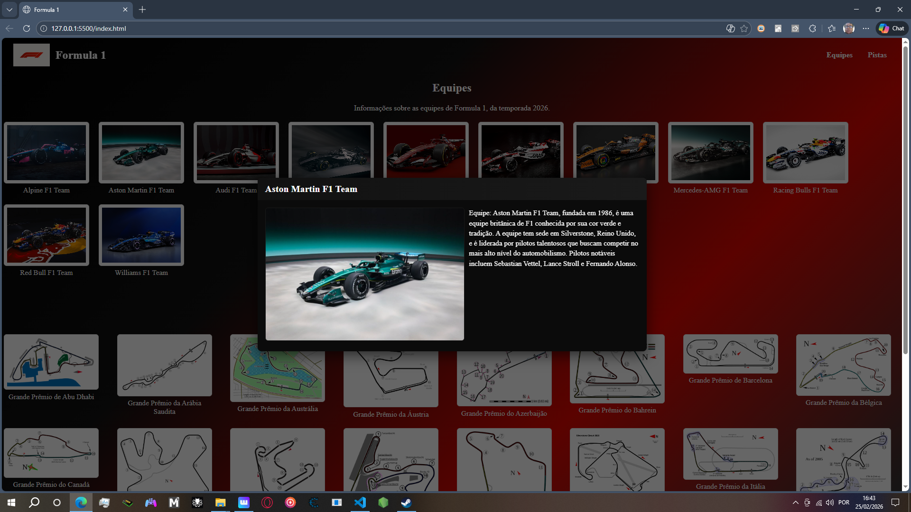

# Funcionalidade do Site sobre Formula temporada 2026

 ## Dividise em 3 partes
- 1ª index.html
- 2ª style.css
- 3ª script.js

## Nav Bar
- Foi feita com a imagem do logo da Formula 1 junto com a escrita formula ao lado esquerdo da pagina.
- Ao lado direito, foi feito dois caracterias com nome "Equipe" e "Pistas", se clicar em uma das duas palavras te direciona para a equipe ou  para as pistas.

## Corpo do Site
- Foi feito dos topicos "Equipes" e "Pistas", foi incluido imagens das Equipes e das Pistas da Formula 1 da temporada 2026.

        

        
        
- Todos as fotos e o logo da Formula 1 estão divididos em pastas.
- Assim que vocÊ clicar no nome da equipe ou da pista, ela abre um pop up contendo a foto e as informações.

 

## Rodapé
- no Rodapé foi colocado um Footer com todos os direitos autorais da marca.
